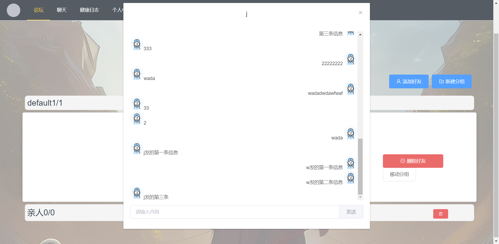

# client

### 前端页面开发进度

## 10.31

最新版本的登录和注册页面已上传，已配合好后端接口，无需再更改\\

正在继续开发论坛页面

## 10.31晚

论坛页面的接口（添加帖子、打开帖子跳转）基本都做好了，前端界面还比较简陋\\

单个文章的组件写好了\\

目前的问题是CSS样式似乎没法正确作用在element-ui上，下次再调

## 11.2

论坛页面基本搞完了，可以跑了，大概长这样:


## 11.3

下午还有小组集体开发，早上起来先摸一点\\

文章页面基本搞完了，可以跑了，大概长这样:


文章编辑页面


## 11.10

### 重要：目前前端存在部分浏览器浏览异常的问题，原因是使用了px而不是em的定位方式！！！计划后续进行修改！！！

错误路由页面


个人主页页面


编辑个人主页页面


文章页面添加了评论窗口


## 11.17

### 重要：目前前端存在部分浏览器浏览异常的问题，原因是使用了px而不是em的定位方式！！！计划后续进行修改！！！

今天小组四个人主要做的都是前后端通信的部分//
聊天页面还在持续开发中

# frontend

## Project setup

```

npm install

yarn install

```

### Compiles and hot-reloads for development

```

npm run serve

yarn serve

```

### Compiles and minifies for production

```

npm run build

yarn build

```

### Lints and fixes files

```

npm run lint

yarn lint

```

### Customize configuration


### 12.8


在Layout/Layout中重构了布局，布局包含header, footer, main, aside以及backtop(滚动到下面点击up即可返回顶端)，后续可以将已写好的页面配置进main中并配置路由。

重构后的布局使用了vh,vw(占页面高宽的比例)作为元素大小的单位，可以shrink to fit，不会出现页面缩放时元素大小不变的问题。

通过localhost:8080/Layout可以查看。

## 12.16

聊天系统前端完善界面，添加好友、新建分组、好友列表显示，好友对话框等完善；基本界面如下。新建分组功能搜索添加好友功能api对接完成


## 12.23

聊天系统发送信息接受信息，移动分组等功能完成api对接完成。

